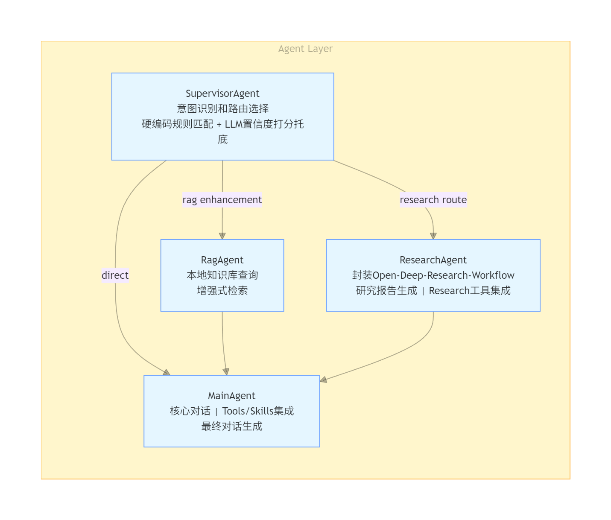

# Self-Bot

一个基于 LangChain 的智能个人助理 Agent，支持多模型、记忆系统、知识库管理和 MCP 工具扩展。

## ✨ 核心特性

### 🤖 多模型支持

- **OpenAI** - GPT-4o, GPT-4-turbo
- **Anthropic** - Claude 3.5 Sonnet
- **DeepSeek** - DeepSeek Chat
- **通义千问** - Qwen3-Plus
- **智谱 GLM** - GLM-4.6
- **MiniMax** - abab6.5s-chat
- **Moonshot** - moonshot-v1-8k
- **Ollama** - 本地模型支持
- 可扩展模型接入的 fallback 机制

### 🧠 智能记忆系统

- **短期记忆** - TikToken 计数、滑动窗口、触发阈值自动摘要、摘要转长期记忆存储
- **长期记忆** - 重要性评估、双路存储 ChromaDB、Markdown 文档
- **会话隔离和加载** - 根据 conversation-id 独立会话上下文，切换时从 SQLite 自动加载会话历史
- **长期记忆使用** - ChromaDB 向量检索（时间衰减、top-k、阈值设定）
- **记忆共享** - 多 agent node 之间共享记忆，实现跨任务的信息传递和协作

### 🔍 RAG 知识库

- 前后端联合实现（知识库管理、文档上传和解析存储 pipeline）
- 文档支持类型（PDF/Word/Excel/Markdown/PPTX/txt）
- 路由策略（文件后缀名、文档特征识别和分类）
- 文档解析器（Mineru、Docling、PaddleOCR、python-pptx、python-docx、openpyxl 等）
- 分块策略（基于文档类型，优先结构、段落分块，短段落拼接，长段落按照固定 Chunk-size 切分，前端可设置）
- 检索 Pipeline（向量检索 ChromaDB + BM25 关键词检索 jieba 分词 → RRF → Reranker）
- Embedding Model（BAAI/bge-base-zh-v1.5）、Reranker Model（BAAI/bge-reranker-base）
- 查询增强（添加上下文信息、查询重写、多查询扩展、metadata 过滤）

> 待完善：用户角色权限管理 RBAC-ABAC、知识库查询权限管理、分块策略语义智能化、解析数据预处理、gold dataset 构建和指标评测

### 🛠️ MCP 工具生态

- 150+ 内置工具 MCP Servers 本地部署 + Function Calling 自实现（使用 LangChain Tool 封装）
- 文档处理：支持 Word、Excel、PPTX、PDF 等格式的文档创建、编辑、保存（设置白名单开放工具权限）
- Notion/FeiShu：管理日程、待办事项、表格创建、群聊消息收发等
- Tool 封装自实现工具：文件读写、Web Search（Tavily、DuckDuckGo、SerpAPI）

> 待完善：更多功能 Tool 待扩展和集成测试、Tool 路由动态加载策略实现（压缩上下文）、Tool 调用鲁棒性提升

### 🎯 Skills 技能系统

- **动态技能加载** - 按需匹配激活
- **智能意图识别** - LLM 驱动的技能匹配
- **Prompt 注入** - 自动注入技能指令
- **追踪监控** - 完整的技能调用链路追踪
- 16+ 内置技能（前端设计、算法艺术、文档协作等）源于 Claude Code Skills 项目

> 待完善：更多高质量 Skills 待扩展和集成测试，根据 Self-Bot 本身需求特性自定义 Skills 提高任务质量

### 💬 对话管理

- SSE 流式响应
- 手动提前中断支持
- 多轮对话管理和状态维护
- 会话历史持久化

### 🎭 Agents 编排

> 待完善内容：
> - 意图识别模块外挂 NLP 文本分类小模型，提高语义理解能力和分类准确度
> - 置信度低时并行路由策略 + 多分支结果选优
> - 新旧架构迭代尚未彻底完成，使用 LangGraph 重新编排后，未经过可靠的 A/B 测试

### 🧱 架构设计

- LangChain 1.0 框架使用（Agent、Tools、Chains、Prompt、LLM、Middleware）
- LangGraph 使用（State、Graph 编排、ToolNode、Checkpointing）
- LangSmith 启用（全链路 Tracer、上下文观测和 Debug 调试）
- React + Vite 前端实现，FastAPI 后端实现

> 架构新特性集成使用:selfqueryretriever模块引入、Middleware 深度扩展 (当前只用于日志记录，后续考虑加入自动脱敏、安全检查等)
> 项目全链缓存引入: 缓存意图分类，工具调用信息， 向量检索
> 分析项目各阶段实现情况，增加熔断与降级处理，增加重试和回退策略
> 参考gemini对话系统, 在回答的结尾增加 ”下一步建议“
> 自进化agent的多步实现

## 🏗️ 项目架构

```
┌─────────────────────────────────────────────────────────────────────────────────┐
│                              Self-Bot 架构图                                     │
├─────────────────────────────────────────────────────────────────────────────────┤
│                                                                                 │
│  ┌─────────────────────────────────────────────────────────────────────────┐   │
│  │                           Frontend (React + Vite)                        │   │
│  │  ┌─────────────┐  ┌─────────────┐  ┌─────────────┐  ┌─────────────┐    │   │
│  │  │   Chat UI   │  │  Sidebar    │  │  Settings   │  │  Knowledge  │    │   │
│  │  │  (流式对话)  │  │  (会话管理) │  │  (模型配置) │  │  (知识库)   │    │   │
│  │  └─────────────┘  └─────────────┘  └─────────────┘  └─────────────┘    │   │
│  │                              │ Zustand State │                           │   │
│  └─────────────────────────────────────────────────────────────────────────┘   │
│                                        │                                       │
│                                        ▼                                       │
│  ┌─────────────────────────────────────────────────────────────────────────┐   │
│  │                        Backend (FastAPI + LangChain)                     │   │
│  │                                                                         │   │
│  │  ┌───────────────────────────────────────────────────────────────────┐ │   │
│  │  │                           API Layer                                │ │   │
│  │  │  /api/chat/stream  /api/conversations  /api/knowledge  /api/search│ │   │
│  │  └───────────────────────────────────────────────────────────────────┘ │   │
│  │                                    │                                    │   │
│  │  ┌───────────────────────────────────────────────────────────────────┐ │   │
│  │  │                         Agent Layer                                │ │   │
│  │  │                   SupervisorAgent (意图识别路由)                   │ │   │
│  │  │  ┌─────────────┐  ┌─────────────┐  ┌─────────────┐               │ │   │
│  │  │  │ MainAgent   │  │  RagAgent   │  │ Researcher  │               │ │   │
│  │  │  │ (主对话)    │  │  (知识检索) │  │  (研究)     │               │ │   │
│  │  │  └─────────────┘  └─────────────┘  └─────────────┘               │ │   │
│  │  │                                                                   │ │   │
│  │  │  ┌─────────────────────────────────────────────────────────────┐ │ │   │
│  │  │  │                    AgentManager                              │ │ │   │
│  │  │  │  • Agent 缓存 (TTL: 1h, Max: 100)                           │ │ │   │
│  │  │  │  • 会话隔离 (conversation_id)                               │ │ │   │
│  │  │  │  • 历史加载 (自动从 DB 加载)                                │ │ │   │
│  │  │  └─────────────────────────────────────────────────────────────┘ │ │   │
│  │  └───────────────────────────────────────────────────────────────────┘ │   │
│  │                                    │                                    │   │
│  │  ┌───────────────────────────────────────────────────────────────────┐ │   │
│  │  │                         Memory Layer                              │ │   │
│  │  │  ┌─────────────────────┐  ┌─────────────────────────────────────┐ │ │   │
│  │  │  │   ShortTermMemory   │  │       LongTermMemory                │ │ │   │
│  │  │  │   (短期记忆)         │  │       (长期记忆)                     │ │ │   │
│  │  │  │  • messages[]       │  │  • MDStorage (文件存储)             │ │ │   │
│  │  │  │  • summaries[]      │  │  • ChromaVectorStore (向量检索)     │ │ │   │
│  │  │  │  • max_tokens: 10k  │  │  • RAGRetriever (RAG 检索)          │ │ │   │
│  │  │  │  • 自动摘要 (80%)   │  │  • 时间衰减权重                     │ │ │   │
│  │  │  └─────────────────────┘  └─────────────────────────────────────┘ │ │   │
│  │  └───────────────────────────────────────────────────────────────────┘ │   │
│  │                                    │                                    │   │
│  │  ┌───────────────────────────────────────────────────────────────────┐ │   │
│  │  │                        Tool Layer (MCP)                           │ │   │
│  │  │  ┌─────────┐ ┌─────────┐ ┌─────────┐ ┌─────────┐ ┌─────────┐     │ │   │
│  │  │  │  Word   │ │  Excel  │ │  PPTX   │ │ Notion  │ │ Feishu  │     │ │   │
│  │  │  │ 54 tools│ │ 25 tools│ │ 37 tools│ │ 4 tools │ │ 19 tools│     │ │   │
│  │  │  └─────────┘ └─────────┘ └─────────┘ └─────────┘ └─────────┘     │ │   │
│  │  └───────────────────────────────────────────────────────────────────┘ │   │
│  │                                    │                                    │   │
│  │  ┌───────────────────────────────────────────────────────────────────┐ │   │
│  │  │                         Skills Layer                              │ │   │
│  │  │  ┌─────────────────────────────────────────────────────────────┐ │ │   │
│  │  │  │  SkillManager: 加载 → 匹配 → 激活 → 注入                     │ │ │   │
│  │  │  └─────────────────────────────────────────────────────────────┘ │ │   │
│  │  │  ┌─────────────┐ ┌─────────────┐ ┌─────────────┐ ┌───────────┐  │ │   │
│  │  │  │ Frontend    │ │ Algorithmic │ │ Skill       │ │ Document  │  │ │   │
│  │  │  │ Design      │ │ Art         │ │ Creator     │ │ Coauthor  │  │ │   │
│  │  │  └─────────────┘ └─────────────┘ └─────────────┘ └───────────┘  │ │   │
│  │  └───────────────────────────────────────────────────────────────────┘ │   │
│  └─────────────────────────────────────────────────────────────────────────┘   │
│                                        │                                       │
│                                        ▼                                       │
│  ┌─────────────────────────────────────────────────────────────────────────┐   │
│  │                           Data Layer                                    │   │
│  │  ┌─────────────┐  ┌─────────────┐  ┌─────────────┐  ┌─────────────┐    │   │
│  │  │   SQLite    │  │  ChromaDB   │  │  MD Files   │  │  Workspace  │    │   │
│  │  │  (会话/消息)│  │  (向量存储) │  │  (长期记忆) │  │  (文档处理) │    │   │
│  │  └─────────────┘  └─────────────┘  └─────────────┘  └─────────────┘    │   │
│  └─────────────────────────────────────────────────────────────────────────┘   │
│                                                                                 │
└─────────────────────────────────────────────────────────────────────────────────┘
```

## 📁 项目结构

```
self-bot/
├── backend/
│   ├── app/
│   │   ├── api/                    # API 路由层
│   │   │   ├── routes.py           # REST API 端点
│   │   │   └── schemas.py          # 请求/响应模型
│   │   │
│   │   ├── langchain/              # Agent 核心模块
│   │   │   ├── agents/             # Agent 实现
│   │   │   │   ├── main_agent.py       # 主对话 Agent
│   │   │   │   ├── rag_agent.py        # RAG 检索 Agent
│   │   │   │   ├── supervisor_agent.py # 监督者 Agent
│   │   │   │   ├── agent_manager.py    # Agent 缓存管理
│   │   │   │   └── state.py            # Agent 状态
│   │   │   │
│   │   │   ├── memory/             # 记忆系统
│   │   │   │   ├── short_term.py       # 短期记忆
│   │   │   │   ├── long_term.py        # 长期记忆
│   │   │   │   ├── summarizer.py       # 摘要生成
│   │   │   │   ├── vector_store.py     # 向量存储
│   │   │   │   └── rag_retriever.py    # RAG 检索器
│   │   │   │
│   │   │   ├── tools/              # 工具集
│   │   │   ├── prompts/            # 提示词模板
│   │   │   ├── services/           # 服务层
│   │   │   └── tracing/            # 追踪日志
│   │   │
│   │   ├── knowledge_base/         # 知识库模块
│   │   │   ├── parsers/            # 文档解析器
│   │   │   ├── services/           # 知识库服务
│   │   │   └── routes/             # 知识库 API
│   │   │
│   │   ├── mcp/                    # MCP 集成
│   │   ├── skills/                 # 技能模块
│   │   ├── db/                     # 数据库
│   │   └── config.py               # 配置管理
│   │
│   ├── mcp_servers/                # MCP 服务器
│   │   ├── word/                   # Word 文档工具
│   │   ├── excel/                  # Excel 工具
│   │   ├── pptx/                   # PPT 工具
│   │   ├── notion/                 # Notion 集成
│   │   └── feishu/                 # 飞书集成
│   │
│   ├── skills/                     # 技能定义
│   ├── prompts/                    # 提示词文件
│   └── data/                       # 数据存储
│       ├── database/               # SQLite 数据库
│       ├── knowledge_base/         # 知识库文件
│       └── agent/                  # Agent 数据
│
├── frontend/                       # React 前端
│   ├── src/
│   │   ├── components/             # UI 组件
│   │   │   ├── Sidebar.tsx         # 侧边栏 (会话管理)
│   │   │   ├── ChatInterface.tsx   # 对话界面
│   │   │   └── ...
│   │   ├── stores/                 # 状态管理
│   │   │   └── chatStore.ts        # Zustand Store
│   │   ├── services/               # API 服务
│   │   └── types/                  # TypeScript 类型
│   └── package.json
│
└── README.md
```

## 🛠️ 技术栈

### 后端

| 类别 | 技术 |
|------|------|
| **Web 框架** | FastAPI, Uvicorn |
| **LLM 框架** | LangChain, LangChain Core |
| **LLM 提供商** | OpenAI, Anthropic, DeepSeek, Qwen, GLM, MiniMax, Moonshot, Ollama |
| **数据库** | SQLite + SQLAlchemy (Async) |
| **向量数据库** | ChromaDB |
| **嵌入模型** | Sentence Transformers (BAAI/bge-base-zh-v1.5) |
| **重排序模型** | BAAI/bge-reranker-base |
| **MCP 协议** | mcp[cli], fastmcp |
| **文档处理** | python-docx, python-pptx, openpyxl |
| **Token 计数** | tiktoken |

### 前端

| 类别 | 技术 |
|------|------|
| **框架** | React 18 |
| **构建工具** | Vite 5 |
| **语言** | TypeScript |
| **状态管理** | Zustand |
| **HTTP 客户端** | Axios |
| **样式** | TailwindCSS |
| **路由** | React Router DOM |
| **图标** | Lucide React |
| **Markdown** | react-markdown, react-syntax-highlighter |

## 🚀 快速开始

### 环境要求

- Python 3.10+
- Node.js 18+
- CUDA（可选，用于本地嵌入模型加速）

### 安装

```bash
# 克隆项目
git clone https://github.com/your-username/self-bot.git
cd self-bot

# 后端安装
cd backend
pip install -r requirements.txt
cp .env.example .env
# 编辑 .env 配置 API Keys

# 前端安装
cd ../frontend
npm install
```

### 启动

```bash
# 启动后端 (端口 8000)
cd backend
python -m uvicorn app.main:app --reload --host 0.0.0.0 --port 8000

# 启动前端 (端口 3000)
cd frontend
npm run dev
```

访问 http://localhost:3000 开始使用。

## ⚙️ 配置

编辑 `backend/.env`：

```env
# LLM Provider (选择一个或多个)
OPENAI_API_KEY=sk-xxx
ANTHROPIC_API_KEY=sk-xxx
DEEPSEEK_API_KEY=sk-xxx
QWEN_API_KEY=sk-xxx
GLM_API_KEY=xxx

# 默认 LLM 提供商
DEFAULT_LLM_PROVIDER=deepseek

# 搜索 API (可选)
TAVILY_API_KEY=tvly-xxx
SERPAPI_API_KEY=xxx

# MCP 预加载
PRELOAD_MCP_TOOLS=true

# 记忆配置
MEMORY_MAX_TOKENS=10000
MEMORY_SUMMARY_THRESHOLD=0.8
MEMORY_KEEP_RECENT=10

# Agent 缓存
AGENT_CACHE_TTL=3600
AGENT_CACHE_MAX_SIZE=100

# 历史加载
HISTORY_LOAD_ENABLED=true
HISTORY_LOAD_LIMIT=20
```

## 📖 功能详解

### 1. 对话管理

```
┌─────────────────────────────────────────────────────────────────┐
│                        对话流程                                  │
├─────────────────────────────────────────────────────────────────┤
│                                                                 │
│  用户发送消息                                                    │
│      │                                                          │
│      ▼                                                          │
│  前端检查 currentConversation                                   │
│      │                                                          │
│      ├── 无 → 创建新会话                                        │
│      └── 有 → 使用现有会话 ID                                   │
│      │                                                          │
│      ▼                                                          │
│  POST /api/chat/stream                                          │
│      │                                                          │
│      ▼                                                          │
│  AgentManager.get_agent(conversation_id)                        │
│      │                                                          │
│      ├── 缓存命中 → 清空短期记忆 → 重新加载历史                  │
│      └── 缓存未命中 → 创建新 Agent → 加载历史                   │
│      │                                                          │
│      ▼                                                          │
│  Agent 处理消息                                                  │
│      │                                                          │
│      ├── 保存用户消息到数据库                                   │
│      ├── 流式返回响应                                           │
│      └── 保存助手消息到数据库                                   │
│      │                                                          │
│      ▼                                                          │
│  前端刷新对话列表                                               │
│                                                                 │
└─────────────────────────────────────────────────────────────────┘
```

### 2. 记忆系统

#### 短期记忆

- **存储**：内存（不持久化）
- **容量**：10000 tokens
- **自动摘要**：利用率达 80% 时触发
- **保留策略**：最近 10 条消息 + 最近 3 个摘要

#### 长期记忆

- **存储**：文件系统 + 向量数据库
- **检索**：向量相似度 + 时间衰减
- **去重**：相似度 > 95% 跳过存储
- **重要性评估**：只存储重要性 >= 3 的内容

### 3. 会话隔离

每个会话的消息和记忆完全隔离：

- 数据库查询使用 `WHERE conversation_id = ?`
- Agent 缓存按 `conversation_id` 区分
- 切换会话时自动清空并重新加载历史

### 4. MCP 工具

| 服务 | 工具数 | 功能 |
|------|--------|------|
| Word | 54 | 文档创建、编辑、PDF 转换、批注、保护 |
| Excel | 25 | 表格操作、数据处理、图表、透视表 |
| PPTX | 37 | 幻灯片创建、设计、动画、模板 |
| Notion | 4 | 笔记管理、数据库操作 |
| Feishu | 19 | 飞书文档、多维表格 |

### 5. Skills 技能系统

Skills 是模块化的能力扩展包，为 Agent 提供专业领域的知识和工作流程。

#### 内置技能列表

| 技能名称 | 描述 | 适用场景 |
|---------|------|---------|
| `frontend-design` | 生产级前端界面设计 | 网页、组件、UI 设计 |
| `algorithmic-art` | p5.js 算法艺术创作 | 生成艺术、粒子系统 |
| `skill-creator` | 技能创建指南 | 创建新技能 |
| `mcp-builder` | MCP 服务器构建 | 开发 MCP 工具 |
| `doc-coauthoring` | 文档协作 | 多人文档编辑 |
| `canvas-design` | Canvas 绘图 | 图形绘制 |
| `theme-factory` | 主题工厂 | UI 主题生成 |
| `brand-guidelines` | 品牌指南 | 品牌设计规范 |
| `internal-comms` | 内部沟通 | 企业沟通内容 |
| `webapp-testing` | Web 应用测试 | 前端测试 |
| `web-artifacts-builder` | Web 构件构建 | Web 组件开发 |
| `slack-gif-creator` | Slack GIF 创建 | 动图制作 |
| `docx` | Word 文档处理 | 文档操作 |
| `xlsx` | Excel 表格处理 | 表格操作 |
| `pptx` | PPT 演示文稿 | 幻灯片制作 |
| `pdf` | PDF 文档处理 | PDF 操作 |

## 🔧 开发

```bash
# 运行后端测试
cd backend
pytest

# 代码检查
ruff check app/

# 类型检查
pyright app/

# 前端构建
cd frontend
npm run build
```

## 📊 API 端点

| 端点 | 方法 | 说明 |
|------|------|------|
| `/api/chat/stream` | POST | 流式对话 |
| `/api/conversations` | GET | 获取会话列表 |
| `/api/conversations/{id}` | GET | 获取会话详情 |
| `/api/conversations/{id}` | PATCH | 更新会话（重命名）|
| `/api/conversations/{id}` | DELETE | 删除会话 |
| `/api/settings` | GET | 获取设置 |
| `/api/knowledge/bases` | GET | 获取知识库列表 |
| `/api/knowledge/search` | POST | 知识检索 |

## 📄 License

MIT License

## 🤝 贡献

欢迎 Issue 和 Pull Request！
