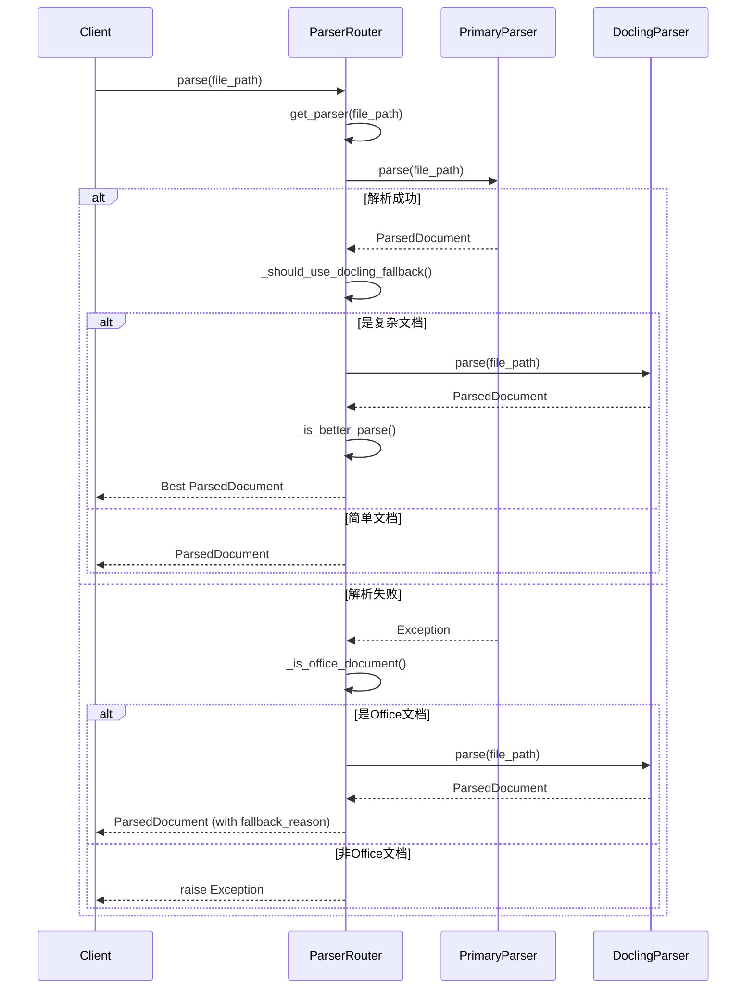
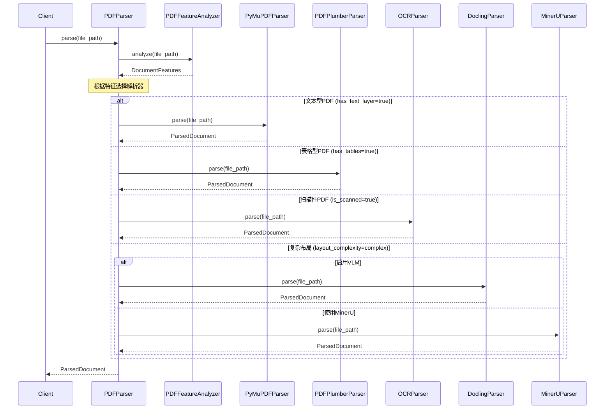

# Parser模块架构设计文档

## 一、架构概览

Parser模块采用**策略模式 + 路由器模式**设计，支持多种文档格式的解析，并具备智能路由和回退机制。

```
┌─────────────────────────────────────────────────────────────────────────────┐
│                              ParserRouter                                    │
│                         (文档解析路由器 - 入口)                                │
└─────────────────────────────────────────────────────────────────────────────┘
                                      │
                    ┌─────────────────┼─────────────────┐
                    │                 │                 │
                    ▼                 ▼                 ▼
            ┌───────────────┐ ┌───────────────┐ ┌───────────────┐
            │ PrimaryParser │ │ PrimaryParser │ │ PrimaryParser │
            │   (主解析器)   │ │   (主解析器)   │ │   (主解析器)   │
            └───────────────┘ └───────────────┘ └───────────────┘
                    │                 │                 │
                    ▼                 ▼                 ▼
            ┌───────────────┐ ┌───────────────┐ ┌───────────────┐
            │ DocxParser    │ │ PPTXParser    │ │ PDFParser     │
            │ PPTXParser    │ │ ExcelParser   │ │ (智能路由)    │
            │ ...           │ │ ...           │ │               │
            └───────────────┘ └───────────────┘ └───────────────┘
                    │                                     │
                    │         ┌───────────────────────────┤
                    │         │                           │
                    ▼         ▼                           ▼
            ┌───────────────┐              ┌───────────────────────┐
            │ DoclingParser │◄─────────────│  Fallback Parser      │
            │  (备选解析器)  │   回退机制    │  (复杂文档/失败回退)   │
            └───────────────┘              └───────────────────────┘
```

## 二、类图 (Class Diagram)

```mermaid
classDiagram
    %% 基础抽象类和数据模型
    class DocumentParser {
        <<abstract>>
        +token_model: str
        +_token_counter: TokenCounter
        +parse(file_path: str) ParsedDocument*
        +supported_extensions() List[str]*
        +count_tokens(text: str) int
        +chunk_text(text, chunk_size, overlap) List[str]
    }
    
    class ParsedDocument {
        +content: str
        +doc_metadata: Dict
        +pages: List[Dict]?
        +sections: List[Dict]?
        +tables: List[Dict]?
        +images: List[Dict]?
    }
    
    class ChunkResult {
        +content: str
        +token_count: int
        +page_number: int?
        +section_title: str?
        +chunk_metadata: Dict
    }
    
    class TokenCounter {
        -_instance: TokenCounter$
        -_encoders: Dict$
        +get_encoder(model) Any
        +count_tokens(text, model) int
        +count_tokens_batch(texts, model) List[int]
    }
    
    %% 路由器
    class ParserRouter {
        +config: Dict
        -_primary_parsers: Dict
        -_fallback_parser: DoclingParser
        -_complex_doc_thresholds: Dict
        +get_parser(file_path) DocumentParser?
        +get_parser_by_type(file_type) DocumentParser?
        +parse(file_path, enable_fallback) ParsedDocument
        +parse_and_chunk(file_path, chunk_size, overlap) List[ChunkResult]
        +chunk_parsed_document(parsed_doc, chunk_size, overlap) List[ChunkResult]
        +supported_extensions() List[str]
        +is_supported(file_path) bool
        -_is_office_document(file_path) bool
        -_should_use_docling_fallback(file_path, parsed_doc, error) bool
        -_check_docling_available() bool
        -_is_better_parse(new_doc, old_doc) bool
    }
    
    %% 具体解析器
    class MarkdownParser {
        +parse(file_path) ParsedDocument
        +supported_extensions() List[str]
        +chunk_with_sections(parsed_doc, chunk_size, overlap) List[ChunkResult]
    }
    
    class TXTParser {
        +parse(file_path) ParsedDocument
        +supported_extensions() List[str]
        +chunk_with_paragraphs(parsed_doc, chunk_size, overlap) List[ChunkResult]
    }
    
    class DocxParser {
        +parse(file_path) ParsedDocument
        +supported_extensions() List[str]
        +chunk_with_sections(parsed_doc, chunk_size, overlap) List[ChunkResult]
    }
    
    class PPTXParser {
        +parse(file_path) ParsedDocument
        +supported_extensions() List[str]
        +chunk_by_slides(parsed_doc, slides_per_chunk, chunk_size) List[ChunkResult]
    }
    
    class ExcelParser {
        +parse(file_path) ParsedDocument
        +supported_extensions() List[str]
        +chunk_by_sheets(parsed_doc, chunk_size) List[ChunkResult]
    }
    
    %% PDF解析器（包含智能路由）
    class PDFParser {
        +parser_type: str
        -_feature_analyzer: PDFFeatureAnalyzer
        -_parsers: Dict
        +parse(file_path) ParsedDocument
        +supported_extensions() List[str]
        +analyze_features(file_path) DocumentFeatures
        -_select_parser(features) str
    }
    
    class PDFFeatureAnalyzer {
        +analyze(file_path, sample_pages) DocumentFeatures
        -_detect_images(doc, features)
        -_detect_tables(doc, features)
        -_detect_text_layer(doc, features)
        -_detect_language(doc, features)
    }
    
    class DocumentFeatures {
        +page_count: int
        +has_images: bool
        +image_ratio: float
        +has_tables: bool
        +table_ratio: float
        +text_density: float
        +has_text_layer: bool
        +is_scanned: bool
        +layout_complexity: str
        +language: str
        +recommended_parser: str
        +confidence: float
    }
    
    %% PDF子解析器
    class PyMuPDFParser {
        +parse(file_path) ParsedDocument
        +extract_images(file_path) List[Dict]
        +extract_links(file_path) List[Dict]
    }
    
    class PDFPlumberParser {
        +parse(file_path) ParsedDocument
        +extract_tables(file_path) List[Dict]
    }
    
    class OCRParser {
        +config: OCRConfig
        +parse(file_path) ParsedDocument
        +analyze_layout(file_path) List[OCRLayoutBlock]
        +extract_tables(file_path) List[TableStructure]
        +semantic_chunk(file_path) List[SemanticChunk]
    }
    
    class DoclingParser {
        +enable_ocr: bool
        +enable_table_structure: bool
        +use_vlm: bool
        +vlm_model: str
        +export_format: str
        +parse(file_path) ParsedDocument
        -_extract_pages(doc) List[Dict]
        -_extract_sections(doc) List[Dict]
        -_extract_tables(doc) List[Dict]
        -_extract_pictures(doc) List[Dict]
        -_extract_formulas(doc) List[Dict]
    }
    
    class MinerUParser {
        +enable_ocr: bool
        +enable_table: bool
        +parse(file_path) ParsedDocument
        +analyze_layout(file_path) List[LayoutBlock]
        +extract_tables(file_path) List[TableStructure]
        +semantic_chunk(file_path) List[SemanticChunk]
    }
    
    %% 数据类
    class LayoutBlock {
        +block_type: str
        +content: str
        +bbox: Tuple
        +page_number: int
        +confidence: float
        +children: List[LayoutBlock]
        +metadata: Dict
    }
    
    class TableStructure {
        +page_number: int
        +bbox: Tuple
        +html_content: str
        +markdown_content: str
        +caption: str?
        +headers: List[str]
        +rows: List[List[str]]
    }
    
    class SemanticChunk {
        +chunk_id: str
        +content: str
        +chunk_type: str
        +page_numbers: List[int]
        +parent_title: str?
        +section_path: List[str]
        +token_count: int
        +metadata: Dict
    }
    
    %% 继承关系
    DocumentParser <|-- MarkdownParser
    DocumentParser <|-- TXTParser
    DocumentParser <|-- DocxParser
    DocumentParser <|-- PPTXParser
    DocumentParser <|-- ExcelParser
    DocumentParser <|-- PDFParser
    
    %% 组合关系
    ParserRouter --> DocumentParser : uses
    ParserRouter --> DoclingParser : fallback
    PDFParser --> PDFFeatureAnalyzer : uses
    PDFParser --> PyMuPDFParser : contains
    PDFParser --> PDFPlumberParser : contains
    PDFParser --> OCRParser : contains
    PDFParser --> DoclingParser : contains
    PDFParser --> MinerUParser : contains
    
    %% 关联关系
    DocumentParser --> ParsedDocument : creates
    DocumentParser --> ChunkResult : creates
    DocumentParser --> TokenCounter : uses
    PDFFeatureAnalyzer --> DocumentFeatures : creates
    OCRParser --> OCRLayoutBlock : creates
    OCRParser --> TableStructure : creates
    OCRParser --> SemanticChunk : creates
    MinerUParser --> LayoutBlock : creates
    MinerUParser --> TableStructure : creates
    MinerUParser --> SemanticChunk : creates
```



## 三、解析流程图 (Sequence Diagram)

### 3.1 通用文档解析流程



### 3.2 PDF智能路由流程



## 四、组件职责说明

### 4.1 核心组件

| 组件 | 职责 | 关键特性 |
|------|------|----------|
| **ParserRouter** | 文档解析路由入口 | 扩展名路由、复杂文档检测、回退机制 |
| **DocumentParser** | 解析器抽象基类 | 定义统一接口、Token计数、文本分块 |
| **ParsedDocument** | 解析结果数据模型 | 统一的文档表示格式 |

### 4.2 具体解析器

| 解析器 | 支持格式 | 核心能力 | 适用场景 |
|--------|----------|----------|----------|
| **MarkdownParser** | .md, .markdown | 标题识别、章节分块 | 技术文档、README |
| **TXTParser** | .txt | 段落识别、编码检测 | 纯文本文件 |
| **DocxParser** | .docx, .doc | 段落提取、表格提取、章节识别 | Word文档 |
| **PPTXParser** | .pptx, .ppt | 幻灯片遍历、按页分块 | PPT演示文稿 |
| **ExcelParser** | .xlsx, .xls | 工作表遍历、表格提取 | Excel电子表格 |
| **PDFParser** | .pdf | 智能路由、多解析器切换 | 各类PDF文档 |

### 4.3 PDF子解析器

| 解析器 | 核心能力 | 适用场景 |
|--------|----------|----------|
| **PyMuPDFParser** | 快速文本提取、图像提取、链接提取 | 文本型PDF |
| **PDFPlumberParser** | 表格识别、精确布局分析 | 表格型PDF |
| **OCRParser** | OCR识别、版面分析、表格识别 | 扫描件/图片PDF |
| **DoclingParser** | VLM支持、复杂布局、多格式导出 | 复杂布局PDF |
| **MinerUParser** | DeepDoc集成、语义分块、版面分析 | 学术论文、技术文档 |

## 五、设计模式应用

### 5.1 策略模式 (Strategy Pattern)
- `DocumentParser` 定义统一接口
- 各具体解析器实现不同的解析策略
- 运行时可动态切换解析器

### 5.2 路由器模式 (Router Pattern)
- `ParserRouter` 根据文件类型选择解析器
- `PDFParser` 根据文档特征选择子解析器

### 5.3 备忘录模式 (Fallback Pattern)
- 主解析器失败时自动回退到Docling
- 复杂文档自动触发备选解析

### 5.4 单例模式 (Singleton Pattern)
- `TokenCounter` 使用单例确保编码器复用

## 六、扩展指南

### 6.1 添加新解析器

```python
class NewFormatParser(DocumentParser):
    async def parse(self, file_path: str) -> ParsedDocument:
        # 实现解析逻辑
        pass
    
    def supported_extensions(self) -> List[str]:
        return ['.newfmt']
```

### 6.2 注册到路由器

```python
# 在ParserRouter.__init__中添加
self._primary_parsers['.newfmt'] = NewFormatParser()
```

### 6.3 自定义PDF路由策略

```python
# 在PDFParser._select_parser中添加新规则
if features.custom_condition:
    return 'new_pdf_parser'
```

## 七、配置选项

```python
config = {
    'pdf_parser': 'auto',           # PDF解析器类型: auto/pymupdf/ocr/docling/mineru
    'enable_ocr': True,             # 启用OCR
    'enable_table_structure': True, # 启用表格结构识别
    'use_vlm': False,               # 使用VLM（视觉语言模型）
}

router = ParserRouter(config=config)
```

## 八、性能优化建议

1. **缓存解析结果**: 相同文件避免重复解析
2. **并行处理**: 多文档并行解析
3. **增量解析**: 大文件分批处理
4. **内存管理**: 及时释放大文档资源
